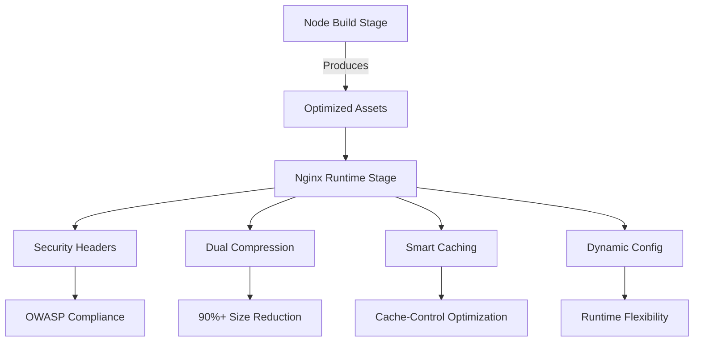

# Multi-Stage Frontend Build & Deploy with Nginx, Brotli, and Secure Headers

This repository demonstrates a multi-stage Docker build process for modern frontend applications. It leverages two specialized Docker images:

- **Node Build Image:** For building and testing the frontend application.
- **Nginx Brotli Image:** For serving pre-compressed static assets with both Brotli and gzip, and for enforcing secure HTTP headers.

The setup also features dynamic environment variable injection and the ability to update security headers (such as Content-Security-Policy) on container startup.

---

## Overview

The solution is split into two main parts:

1. **🛠️ Build Stage (Node):**
   - **Modern Toolchain**:
     - **Node.js 22.13.1** on Alpine Linux 3.21 (lightweight base) to install dependencies, compile assets, and run tests.
     - **Yarn 4.6.0** with Corepack management
     - **Multi-architecture support** through Alpine compatibility
   - **Code Quality Assurance**
     - SonarQube Scanner 7.0.0 integration
     - Java 11 environment for Sonar analysis
     - Dedicated heap space configuration for Sonar (`-Xmx512m`)
   - **Build Capabilities**
     - Essential native tools:
       - FFmpeg (media processing)
       - Libwebp (image conversion)
       - Zstandard (compression)
       - OpenSSL (cryptography)
   - **Optimized Dependency Management**
     - Frozen lockfile installation
     - Global CLI tools:
       - `dotenv-cli` for environment management
       - `cross-spawn` for cross-platform scripting

2. **🚀 Production Stage (`nginx-brotli` Image Features):**
   - Uses an Nginx image enhanced with additional modules (Brotli compression and headers-more).
   - Serves the static assets built in the previous stage.
   - Implements both Brotli and gzip static compression.
   - Applies a comprehensive set of security headers via a dedicated configuration file.
   - Dynamically injects environment variables into the frontend via an `env-config.js` file.

---

## Architecture & Workflow

### 1. Node Build Image

- **Base Image:** `node:22.13.1-alpine3.21`
- **Key Installations:**
  - Native build libraries (e.g., `bash`, `curl`, `ffmpeg`, `openjdk11`, `openssl`, `unzip`, `zstd`).
  - Global Node packages: `dotenv-cli` and `cross-spawn`.
  - **Corepack & Yarn:** Enables Corepack and installs a specific version of Yarn (e.g., 4.6.0).
- **Sonar Scanner Integration:**
  - Downloads and extracts the Sonar Scanner CLI for code quality analysis.
  - Configures Java environment variables and limits the Java heap space for the scanner.

This stage ensures that the application is built, tested, and linted, producing a final build output (typically placed under a folder like `/dist/apps/ui`).

### 2. Nginx Brotli Image

- **Base Image:** `nginx:1.27.0-alpine-slim`
- **Module Building:**
  - The builder stage compiles additional Nginx modules (specifically, the Brotli and headers-more modules) using user-supplied sources and upstream package repositories.
- **Final Image Configuration:**
  - Copies the compiled modules into the runtime image.
  - Replaces the default Nginx HTML content with the built static assets.
  - Loads the Brotli and headers-more modules via `nginx.conf`.

#### Nginx Configuration Highlights

- **Module Loading:**
  - `ngx_http_brotli_filter_module` and `ngx_http_brotli_static_module` for Brotli compression.
  - `ngx_http_headers_more_filter_module` for advanced header management.
- **Compression Settings:**
  - **Brotli:** Enabled with level 11 and configured to compress types such as CSS, JavaScript, XML, and various image formats.
  - **Gzip:** Enabled with level 9 for additional compatibility.
- **Caching & File Handling:**
  - Different caching rules for images, CSS, JS, and HTML files.
  - Special handling for dynamically generated `env-config*.js` files (to support runtime configuration).
- **Security Headers:**  
  The included `headers.conf` file sets several security-related headers:
  - **Permissions Policy:** Disables various browser features.
  - **X-XSS-Protection, Referrer-Policy, X-Frame-Options, X-Content-Type-Options,** and more.
  - **Content-Security-Policy:** Can be updated at runtime via environment variables.

### 3. Dynamic Environment Variable Injection

- **Script:** `env.sh`
  - Scans both the container environment and a local `.env` file.
  - Filters variables based on provided prefixes (e.g., `API`, `APP`).
  - Generates an `env-config.js` file in the document root (`/var/www`), making these variables available to the frontend.
  - Also updates the `Content-Security-Policy` in the `headers.conf` file if a `CONTENT_SECURITY_POLICY` variable is provided.

### 4. Final Combined Dockerfile

The final Dockerfile brings the two stages together:

- **Build Stage:**
  - Uses the Node build image to install dependencies, run tests, lint the code, and compile the production build.
- **Deploy Stage:**
  - Uses the custom Nginx Brotli image to serve the built assets.
  - Copies the compiled assets and the `.env` file into the container.
  - Creates a non-root user and sets proper permissions for security.
  - Exposes the necessary port (8080) and defines the entrypoint to:
    1. Export environment variables.
    2. Run `env.sh` to generate or update the runtime configuration file.
    3. Start Nginx in the foreground.

---

## Benefits of This Setup

- **Separation of Concerns:**  
  - **Build & Test:** The Node container handles application building, testing, and linting in an isolated environment.
  - **Deployment:** The Nginx container focuses solely on serving the static assets, ensuring a small, secure, and optimized production image.

- **Enhanced Performance:**
  - **Brotli & Gzip Compression:** Dual static compression methods provide faster load times and reduced bandwidth usage.
  - **Optimized Caching:** Custom caching rules for different asset types improve content delivery performance.

- **Improved Security:**
  - **Secure Headers:** Enforced via `headers.conf`, protecting against common web vulnerabilities.
  - **Dynamic Content Security Policy:** Can be updated on the fly using environment variables, ensuring that security policies remain current without rebuilding the image.
  - **Non-root Execution:** The final image runs under a non-privileged user (`www`), reducing the risk surface.

- **Flexible Environment Configuration:**
  - **Dynamic Environment Injection:** The `env.sh` script allows environment variables to be injected at container startup, making it easier to adjust configuration without image rebuilds.
  - **Automatic File Detection & Cache Busting:** The script intelligently locates existing configuration files (or creates new ones) to ensure that the frontend always receives the latest settings.

- **Modular and Extensible:**
  - **Custom Module Building:** Ability to build and include extra Nginx modules (like Brotli and headers-more) provides flexibility to adapt to changing requirements.
  - **Alpine-Based Images:** The use of Alpine Linux ensures a minimal footprint and reduced attack surface.

---

## Architectural overview



## Usage

### Building the Images

Assuming you have Docker installed, you can build the images as follows:

1. **Build the Node Image and Compile Assets:**

   ```bash
   docker build -t my-frontend-build -f Dockerfile.node .
   ```

1. **Build the Nginx Brotli Image:**

   ```bash
   docker build -t my-nginx-brotli -f Dockerfile.nginx .
   ```

1. **Sample combined dockerfile**

    ```dockerfile
    ################# Build #################
    FROM adaskothebeast/node-build:v1.3.0 AS build

    # create and change app folder
    WORKDIR /app

    # copy inly files necessary for node packages restore
    COPY package.json yarn.lock check-libs.js ./
    #COPY ./patches ./patches

    # restore with lockfile - less frequent layer rebuild
    RUN yarn install --frozen-lockfile

    # copy whole content to build
    COPY . .

    # patch libs with patches folder
    #RUN yarn postinstall

    # build all
    RUN yarn build && \
      yarn test && \
      yarn lint

    #RUN yarn stylelint:ci:json:docker

    #RUN yarn htmlhint:ci:html:docker

    ################# Final #################
    FROM adaskothebeast/nginx-brotli:v1.27.14-slim AS deploy

    ENV uri=\$uri

    WORKDIR /var/www
    COPY --from=build /app/dist/apps/ui .
    COPY ./.env .

    # Create user
    RUN adduser -D -g 'www' www

    # Set permissions
    RUN mkdir -p /template \
      && mkdir -p /var/lib/nginx \
      && chown -R www:www /etc/nginx \
      && chown -R www:www /var/lib/nginx \
      && chown -R www:www /var/cache/nginx \
      && chown -R www:www /var/www \
      && chown -R www:www /tmp \
      && chmod -R 770 /tmp

    VOLUME ["/var/cache/nginx"]

    # Expose server ports
    EXPOSE 8080

    # export command exports given env variable to be visible
    # highly inspired by two articles
    # https://developers.redhat.com/blog/2021/03/04/making-environment-variables-accessible-in-front-end-containers#conclusion
    # in comments there is information about "sponge"
    # https://github.com/joellord/frontend-containers/blob/main/envvars.md
    # https://github.com/joellord/frontend-containers/blob/main/rootless.md
    # https://github.com/joellord/frontend-containers/tree/main/react-project
    # script modifies env-config.js file
    # and also CONTENT_SECURITY_POLICY in headers.conf
    ENTRYPOINT ["sh", "-c", "export API_BASE_URL \
      && export APP_TENANT_ID \
      && export APP_CLIENT_ID \
      && export API_SCOPES \
      && /usr/local/bin/env.sh API APP \
      && nginx -g 'daemon off;'"]
    USER www

    ```

1. **Build the Final Combined Image:**

   ```bash
   docker build -t my-frontend-app .
   ```
